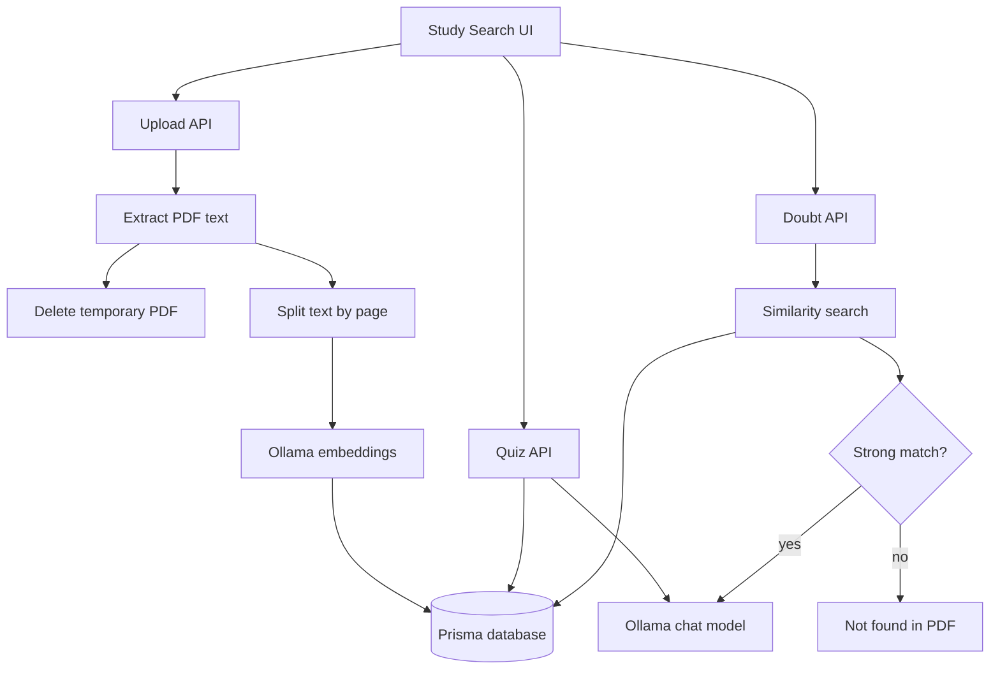

# Free Study Search - Plan

## Goal Capsule

- **Objective:** Add a free Study Search feature where a student uploads a PDF, generates 5 or 10 quizzes, and asks doubts answered only from the uploaded material.
- **Primary constraint:** Do not save the original PDF in the database.
- **Cost constraint:** Use local/free AI through Ollama-compatible services instead of paid AI APIs.
- **Execution profile:** Build as a Next.js feature using existing `src/app`, `src/components`, `src/lib`, and Prisma patterns.
- **Stop condition:** The feature is ready when PDF upload, quiz generation, grounded doubt answering, no-match handling, and database limits work locally.

---

## Product Contract

### Summary

Students can upload one PDF study file, then choose either quiz generation or doubt chat.
The system extracts text, deletes the uploaded file after processing, stores only small searchable text chunks, and refuses to answer when a question is not supported by the uploaded content.

### Requirements

**Upload and storage**

- R1. The student can upload a PDF from the Study Search screen.
- R2. The system must reject non-PDF files, PDFs over 5 MB, and PDFs over 30 pages for the first MVP.
- R3. The system must extract text and page numbers from the PDF.
- R4. The system must delete the uploaded PDF after text extraction finishes or fails.
- R5. The database must store document metadata, extracted chunks, page numbers, embeddings, and usage counters, not the original PDF binary.

**Quiz generation**

- R6. The student can choose 5 or 10 quiz questions after upload.
- R7. The system must generate MCQ questions only from extracted PDF text.
- R8. Each quiz item must include a question, four options, the correct answer, and a short explanation.

**Ask doubt**

- R9. The student can ask questions about the uploaded PDF.
- R10. The system must search the stored chunks before asking the AI to answer.
- R11. If matching chunks are found, the answer must use only those chunks and show source page references.
- R12. If no strong match is found, the system must say the answer was not found in the uploaded PDF and must not guess.

**Limits**

- R13. The MVP should allow at most 10 doubt questions per document.
- R14. The MVP should keep quiz count capped at 10 questions per generation.
- R15. The UI should explain limits through validation messages, not long help text.

### Key Flow

- F1. PDF study flow
  - **Trigger:** Student opens Study Search.
  - **Steps:** Upload PDF, validate file, extract text, delete PDF, create chunks and embeddings, show quiz and doubt actions.
  - **Outcome:** Student can generate 5 or 10 questions or ask doubts from the uploaded material.
  - **Covers:** R1, R2, R3, R4, R5, R6, R9

- F2. Unsupported doubt flow
  - **Trigger:** Student asks a question not present in the uploaded PDF.
  - **Steps:** Search chunks, compare best match score with threshold, return refusal message when score is too low.
  - **Outcome:** The app does not hallucinate or answer from outside material.
  - **Covers:** R10, R11, R12

### Acceptance Examples

- AE1. Given a valid 3 MB PDF, when upload completes, then the original PDF file is removed and chunk records remain searchable.
- AE2. Given a processed PDF, when the student selects 10 questions, then the app returns exactly 10 MCQs grounded in the PDF text.
- AE3. Given a processed PDF about biology, when the student asks a matching biology question, then the answer cites one or more PDF pages.
- AE4. Given a processed PDF about biology, when the student asks an unrelated math question, then the app says the answer was not found in the uploaded PDF.

---

## Planning Contract

### Key Technical Decisions

- KTD1. **Use local Ollama for free AI.** Use Ollama chat and embedding models to avoid paid API cost. Suggested models are `qwen2.5` or `llama3.1` for chat and `nomic-embed-text` for embeddings.
- KTD2. **Store extracted text chunks, not PDFs.** The original PDF is temporary file data only. Prisma stores metadata and chunks so the small database stays under control.
- KTD3. **Start with database-backed vector similarity if possible, otherwise use JSON embeddings in PostgreSQL for MVP.** The first implementation can store embedding arrays in Prisma as JSON and compute cosine similarity in application code for small documents.
- KTD4. **Gate answers by retrieval confidence.** If the best chunk score is below the threshold, return a no-match message instead of calling the chat model for a free-form answer.
- KTD5. **Keep PDF support only for MVP.** DOCX, PPT, image OCR, flashcards, and revision plans are deferred until the PDF flow is stable.

### High-Level Technical Design

### Data Model

Add Prisma models in `prisma/schema.prisma` and mirror required changes in `prisma/schema.netlify.prisma` if that schema is still used for deployment.

- `StudyDocument`: `id`, `userId`, `fileName`, `pageCount`, `chunkCount`, `doubtCount`, `createdAt`.
- `StudyChunk`: `id`, `documentId`, `pageNumber`, `content`, `embeddingJson`, `createdAt`.
- `StudyQuiz`: `id`, `documentId`, `questionCount`, `itemsJson`, `createdAt`.

### Limits

| Limit | MVP value | Reason |
|---|---:|---|
| PDF file size | 5 MB | Keeps upload and extraction fast |
| PDF pages | 30 | Controls chunk count |
| Quiz count | 5 or 10 | Gives user choice without heavy compute |
| Doubts per document | 10 | Protects local model time |
| File type | PDF only | Keeps MVP focused |

---

## Implementation Units

### U1. Data Models and Study Library

- **Goal:** Add database models and shared helpers for Study Search documents and chunks.
- **Requirements:** R5, R13, R14
- **Files:** `prisma/schema.prisma`, `prisma/schema.netlify.prisma`, `src/lib/study/types.ts`, `src/lib/study/chunking.ts`, `src/lib/study/similarity.ts`
- **Approach:** Add Prisma relations from `User` to study documents. Create helpers for chunking extracted text and calculating cosine similarity.
- **Test Scenarios:** Chunking preserves page numbers. Similarity returns highest score first. Empty text returns no chunks.
- **Verification:** Run `npm run lint` and `npm run db:generate`.

### U2. Local AI Adapter

- **Goal:** Add a small Ollama adapter for embeddings, grounded answers, and quiz generation.
- **Requirements:** R7, R8, R10, R11, R12
- **Files:** `src/lib/study/ollama.ts`, `.env.example`
- **Approach:** Read `OLLAMA_BASE_URL`, `OLLAMA_CHAT_MODEL`, and `OLLAMA_EMBED_MODEL`. Keep prompts strict: answer only from context and output structured JSON for quizzes.
- **Test Scenarios:** Quiz prompt requests exactly 5 or 10 questions. Doubt prompt includes only retrieved chunks. Missing Ollama config returns a clear setup error.
- **Verification:** Run `npm run lint`.

### U3. Upload API

- **Goal:** Accept a PDF, validate it, extract text, delete the file, chunk content, create embeddings, and save only metadata/chunks.
- **Requirements:** R1, R2, R3, R4, R5
- **Files:** `src/app/api/study-search/upload/route.ts`, `src/lib/study/pdf.ts`
- **Approach:** Use a PDF parser package such as `pdf-parse` or a compatible server-side PDF text extractor. Use temporary storage only for request processing.
- **Test Scenarios:** Non-PDF upload is rejected. Oversized PDF is rejected. Valid PDF produces a `StudyDocument`. Temporary file cleanup runs on success and failure.
- **Verification:** Run `npm run lint` and a manual upload smoke test.

### U4. Quiz API

- **Goal:** Generate 5 or 10 MCQs from stored chunks for one document.
- **Requirements:** R6, R7, R8, R14
- **Files:** `src/app/api/study-search/documents/[documentId]/quiz/route.ts`
- **Approach:** Validate the requested count, load enough chunks from the selected document, call the local AI adapter, validate JSON shape, and store the result as `StudyQuiz`.
- **Test Scenarios:** Count accepts only 5 or 10. Quiz uses only document chunks. Bad AI JSON returns a friendly retry error.
- **Verification:** Run `npm run lint` and manual quiz generation smoke test.

### U5. Doubt API

- **Goal:** Answer student doubts only when the uploaded material has matching content.
- **Requirements:** R9, R10, R11, R12, R13
- **Files:** `src/app/api/study-search/documents/[documentId]/doubt/route.ts`
- **Approach:** Embed the student question, search stored chunks, apply a similarity threshold, and call the chat model only when the threshold passes.
- **Test Scenarios:** Matching question returns an answer with page sources. Unmatched question returns no-match message. The eleventh doubt for one document is blocked.
- **Verification:** Run `npm run lint` and manual matched/unmatched doubt smoke tests.

### U6. Study Search UI

- **Goal:** Add the student-facing page with upload, quiz count selection, quiz results, doubt chat, sources, and limit states.
- **Requirements:** R1, R6, R9, R11, R12, R15
- **Files:** `src/app/study-search/page.tsx`, `src/components/study-search/study-search-client.tsx`, `src/components/dashboard/sidebar.tsx`
- **Approach:** Follow existing dashboard component style. Use segmented controls or buttons for 5 and 10 quiz choices. Show page source chips for grounded answers.
- **Test Scenarios:** Upload state, processing state, upload error state, quiz count selection, no-match doubt response, and source chips render correctly on desktop and mobile.
- **Verification:** Run `npm run lint` and inspect the page locally.

---

## Verification Contract

| Gate | Command or Check | Proves |
|---|---|---|
| Static check | `npm run lint` | TypeScript and lint rules pass |
| Prisma client | `npm run db:generate` | New models compile |
| Upload smoke | Manual valid and invalid PDF uploads | R1-R5 |
| Quiz smoke | Generate 5 and 10 quizzes | R6-R8 |
| Doubt smoke | Ask one matching and one unrelated question | R9-R13 |
| Cleanup check | Confirm no uploaded PDF remains after processing | R4 |

---

## Definition of Done

- Study Search is reachable from the app UI.
- A student can upload a valid PDF under the MVP limits.
- The original PDF is not saved in the database and is removed after processing.
- The student can generate either 5 or 10 MCQ questions.
- The student can ask doubts and receive answers with page references when the answer exists in the PDF.
- The system refuses unrelated questions with a clear no-match message.
- Usage limits are enforced.
- The implementation uses free local AI configuration by default.
- Lint and Prisma generation pass.
- Any temporary or experimental code from implementation is removed before final handoff.
