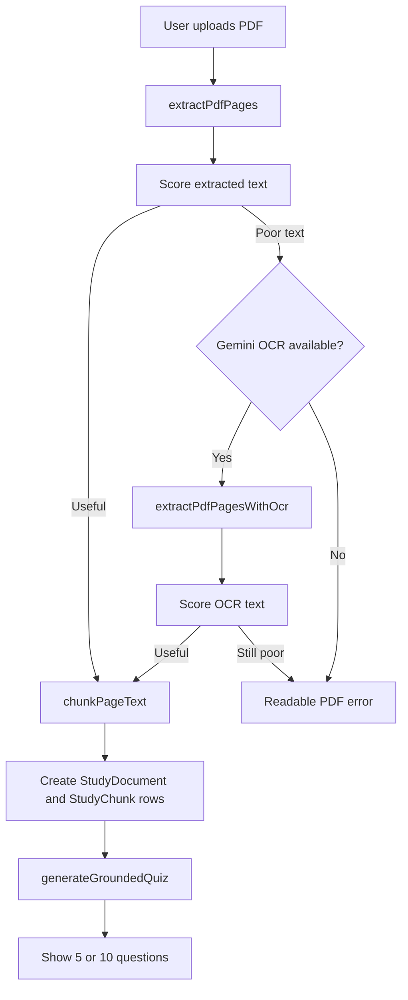

# AI Exam PDF Text Extraction - Plan

## Goal Capsule

| Field | Value |
|---|---|
| Objective | Make AI Exam Mode reliably generate 5 or 10 grounded questions from uploaded PDFs by improving the text extraction path before the quiz prompt runs. |
| Scope | PDF upload, extraction quality detection, OCR fallback, quiz generation prompt input, user-facing errors, and focused tests. |
| Primary files | `src/lib/study/pdf.ts`, `src/app/api/study-search/upload/route.ts`, `src/lib/study/ai.ts`, `src/components/dashboard/pages/study-search.tsx` |
| Stop condition | A text-selectable PDF uses normal extraction, a scanned/image PDF can use OCR fallback when a cloud vision model is configured, and poor PDFs fail with a precise reason before quiz generation. |
| Tail ownership | Implementation should include local verification and a live-deploy smoke test on Netlify with a small PDF. |

---

## Product Contract

### Summary

AI Exam Mode should treat clean PDF text as the contract between upload and quiz generation.
The app should first extract text normally, measure whether that text is useful, and only then send it to the quiz generator.
If normal extraction fails or produces poor text, the app should try an OCR fallback through Gemini because the project already carries `GEMINI_API_KEY`.
If neither path yields usable study text, the user should get a direct PDF-readability message instead of the current generic quiz-generation failure.

### Problem Frame

The current flow can reach quiz generation with weak or broken PDF text.
`src/lib/study/pdf.ts` extracts text with `pdf-parse` and a simple stream parser, while `src/app/api/study-search/upload/route.ts` chunks whatever survived the quality gate.
`src/lib/study/ai.ts` then rejects AI output if fewer than the requested 5 or 10 valid questions pass validation.
This produces the confusing error: "The AI generated no usable PDF-grounded questions."
The real failure often happened earlier: the uploaded PDF did not produce clean study text.

### Requirements

**PDF Text Pipeline**

- R1. The upload flow must separate extraction success from text usefulness so users can see whether a PDF was read cleanly.
- R2. Text-selectable PDFs must keep using the existing local extraction path without requiring OCR.
- R3. Scanned or image-heavy PDFs must attempt OCR fallback when `GEMINI_API_KEY` is configured.
- R4. OCR fallback must return page-numbered text in the same `PageText[]` shape used by the existing chunking code.
- R5. The upload API must not create a `StudyDocument` until it has enough useful text to chunk.

**Quiz Generation**

- R6. Quiz generation must send only clean, useful study text to `generateGroundedQuiz`.
- R7. The generator must fail early with a PDF-readability error when there are no useful chunks.
- R8. The final "not enough questions" error must distinguish bad extraction from bad AI output.

**User Experience**

- R9. The UI must tell users when the PDF appears scanned, has too little text, or needs OCR.
- R10. The UI must keep the existing 5-question and 10-question exam mode choices.
- R11. The UI must not expose internal terms like embeddings, chunks, Prisma, or model JSON.

**Operational Constraints**

- R12. The implementation must work on Netlify serverless functions with no local Ollama dependency.
- R13. The implementation must respect the existing PDF size limit unless the implementer also updates the upload limit and UI copy together.
- R14. The fallback must avoid storing raw uploaded PDF files permanently.
- R15. The implementation must not log raw extracted text, OCR text, uploaded PDF contents, or generated embeddings.

### Acceptance Examples

- AE1. Covers R1, R2, R6. Given a text-selectable PDF with chapter notes, when the user uploads it and asks for 5 questions, then the app generates 5 grounded questions without OCR.
- AE2. Covers R3, R4, R6. Given a scanned PDF under the upload limit and a valid `GEMINI_API_KEY`, when normal extraction returns poor text, then OCR produces page text and Exam Mode can generate questions from it.
- AE3. Covers R7, R9. Given an image-only PDF and no OCR-capable key, when upload finishes extraction, then the API returns a clear message asking for a text-selectable PDF or OCR-enabled setup.
- AE4. Covers R8, R10. Given useful extracted text but AI returns malformed options, when quiz validation rejects the result, then the error says the AI response was not usable and suggests retrying with 5 questions.

### Scope Boundaries

- Do not build a full document viewer or manual text editor in this pass.
- Do not replace Groq/Gemini quiz generation with a new AI provider.
- Do not permanently store uploaded PDF binaries.
- Do not add local Ollama back as a production requirement.

---

## Planning Contract

### Key Technical Decisions

- KTD1. Use a three-stage extraction pipeline. The stages are normal PDF text extraction, quality scoring, and OCR fallback. This keeps good PDFs fast while giving scanned PDFs a real path.
- KTD2. Put OCR behind a new helper in `src/lib/study/pdf.ts` or a sibling module such as `src/lib/study/pdf-ocr.ts`. The upload route should orchestrate extraction but not contain provider-specific OCR code.
- KTD3. Use Gemini for OCR fallback first. The repo already has `GEMINI_API_KEY`, Gemini can process document/image content, and this avoids adding a separate OCR service key. R15 owns the privacy guardrail for this third-party text flow.
- KTD4. Preserve the existing `PageText[]` and chunking contracts. The downstream upload, embedding, quiz, and doubt flows already depend on page-numbered text.
- KTD5. Record extraction metadata in the upload response, not in the database unless persistence is needed later. The immediate product need is user feedback and API branching, not historical analytics.
- KTD6. Keep Groq/Gemini quiz generation separate from OCR. OCR creates clean source text; quiz generation creates questions from that source text.

### High-Level Technical Design

### Dependencies And Assumptions

- `GEMINI_API_KEY` is available in Netlify and local development for OCR fallback.
- `src/lib/study/types.ts` currently limits PDFs to 5 MB and 30 pages.
- Existing upload routes already run with `runtime = "nodejs"`, which is required for PDF parsing.
- There is no existing test harness in the repo, so implementation should add one or use the repo's chosen lightweight test runner.

### Risks

| Risk | Impact | Mitigation |
|---|---|---|
| Gemini OCR API shape or file upload constraints differ from assumptions | OCR fallback may fail on live deploy | Isolate Gemini calls in one helper and test with small sample PDFs before wiring UI copy |
| Serverless execution time increases | Netlify functions can time out on large PDFs | Keep current PDF size limit, cap OCR pages, and fail with a clear message when work is too large |
| OCR returns noisy text | AI still generates weak questions | Reuse `getStudyTextQuality` after OCR and reject bad OCR before creating chunks |
| AI returns answer text that does not match options exactly | Valid questions get rejected | Improve normalization only inside quiz parsing, without accepting ungrounded questions |
| Raw study content enters logs | Private student notes could leak through deploy logs | Follow R15 and log only counts, quality scores, page counts, provider status, and error codes |

---

## Implementation Units

### U1. Extraction Result Contract

- **Goal:** Make PDF extraction return text plus quality metadata so upload can make better decisions.
- **Requirements:** R1, R2, R5, R7.
- **Files:** `src/lib/study/pdf.ts`, `src/lib/study/chunking.ts`, `src/lib/study/types.ts`.
- **Approach:** Add a result type that carries `pages`, `source`, and quality fields. Keep `extractPdfPages` compatible or add a new `extractPdfPagesWithDiagnostics` wrapper so current callers do not break.
- **Test Scenarios:** A text PDF returns pages with `source: "pdf-text"`; a blank or image-like PDF returns poor quality diagnostics; a malformed PDF returns a readable extraction error.
- **Verification:** Add focused tests for the new extraction result helper and quality classification.

### U2. Gemini OCR Fallback

- **Goal:** Add OCR fallback for scanned or image-heavy PDFs.
- **Requirements:** R3, R4, R12, R14, R15.
- **Files:** `src/lib/study/pdf.ts`, optional `src/lib/study/pdf-ocr.ts`, `src/lib/study/types.ts`.
- **Approach:** Implement a Gemini OCR helper that accepts a PDF buffer, asks for page-separated study text, and maps the response into `PageText[]`. Cap OCR to the existing page and file limits.
- **Test Scenarios:** With `GEMINI_API_KEY` absent, fallback reports unavailable; with a mocked Gemini response, fallback returns page-numbered text; with a malformed Gemini response, fallback returns a controlled error; raw extracted text does not appear in logs.
- **Verification:** Unit tests should mock `fetch` and avoid real API calls.

### U3. Upload Route Orchestration

- **Goal:** Ensure the upload route only stores documents after clean text exists.
- **Requirements:** R1, R5, R6, R7, R9.
- **Files:** `src/app/api/study-search/upload/route.ts`.
- **Approach:** Try normal extraction, score quality, optionally run OCR fallback, score again, then call `chunkPageText`. Return extraction-specific errors before creating `StudyDocument`.
- **Test Scenarios:** Text PDF path creates document and chunks; poor normal extraction with OCR success creates chunks from OCR text; poor extraction without OCR returns a 400 with user-facing copy; chunk creation failure still deletes the created document.
- **Verification:** Route-level tests should mock `db`, `extractPdfPages`, OCR helper, and `createEmbedding`.

### U4. Quiz Error Classification

- **Goal:** Make quiz-generation failures identify whether the PDF text or AI response caused the problem.
- **Requirements:** R6, R7, R8, R10.
- **Files:** `src/lib/study/ai.ts`, `src/app/api/study-search/documents/[documentId]/quiz/route.ts`.
- **Approach:** Introduce named error classes or error codes for unreadable source text, insufficient source text, AI timeout, AI provider error, and invalid quiz output. Map those codes to precise API messages.
- **Test Scenarios:** No useful chunks returns a PDF-readability message; useful chunks plus malformed AI output returns an AI-output message; timeout returns a retry message.
- **Verification:** Unit tests should cover `generateGroundedQuiz` error branches with mocked AI responses.

### U5. UI Feedback Copy

- **Goal:** Show practical guidance when upload or quiz generation fails.
- **Requirements:** R9, R10, R11.
- **Files:** `src/components/dashboard/pages/study-search.tsx`.
- **Approach:** Preserve the current toast flow, but render extraction-specific messages from the API. Suggested copy: "We could not read enough clean text from this PDF. Please upload a text-selectable PDF or use OCR." For OCR-enabled failures, mention trying a clearer scan or smaller PDF.
- **Test Scenarios:** Upload failure displays the API message; quiz failure displays the API message; successful upload still resets questions and opens the selected tool.
- **Verification:** Component tests can be added if the repo adopts a frontend test runner; otherwise verify manually in local browser.

### U6. Live Deploy Smoke Test

- **Goal:** Confirm the fix works in the production environment.
- **Requirements:** R12, R13.
- **Files:** `DEPLOY-NETLIFY.md`, `.env.example`.
- **Approach:** Document the required OCR/AI env vars and add a short troubleshooting note for scanned PDFs. Keep `.env.example` blank for secrets.
- **Test Scenarios:** Netlify has `GEMINI_API_KEY`, `GEMINI_MODEL`, `GROQ_API_KEY`, `GROQ_MODEL`, `JWT_SECRET`, and `DATABASE_URL`; a small text PDF generates 5 questions; a scanned PDF either generates questions through OCR or returns the OCR-specific error.
- **Verification:** Redeploy and test the live URL with one text PDF and one scanned PDF under the limit.

---

## Verification Contract

| Gate | Applies To | Done Signal |
|---|---|---|
| `npm run lint` | All units | No new lint errors in touched files. |
| `npx tsc --noEmit` | All units | TypeScript accepts new extraction, OCR, and error contracts. |
| New extraction tests | U1, U2 | Normal extraction, OCR fallback, and poor-text branches are covered. |
| New upload route tests | U3 | Upload creates documents only after useful text exists. |
| New quiz tests | U4 | PDF-readability errors and invalid-AI-output errors map to different messages. |
| Manual local smoke | U3, U4, U5 | Upload a text-selectable PDF and generate 5 questions. |
| Manual Netlify smoke | U6 | Live deploy generates 5 questions from a small text PDF and handles a scanned PDF clearly. |

---

## Definition of Done

- The app can generate 5 and 10 questions from a normal text-selectable PDF.
- A scanned PDF has an OCR fallback when Gemini is configured.
- A PDF that still cannot produce clean text fails before quiz generation with a clear user-facing message.
- AI-output validation failures are not confused with PDF-readability failures.
- No real secrets are added to `.env.example` or committed files.
- Raw PDF text, OCR text, and embeddings are not logged.
- Tests or documented manual smoke checks cover normal extraction, OCR fallback, and failure messages.
- Dead-end experimental code is removed before final delivery.
