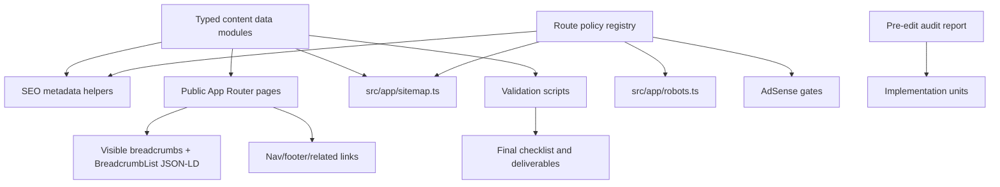

# AdSense Low Value Content Recovery - Plan

## Goal Capsule

| Field | Value |
|---|---|
| Objective | Improve StudySpark's public website so it has substantial, original, people-first educational value and follows Google AdSense and Google Search quality guidance without breaking existing tools, auth, APIs, branding, or user data. |
| Primary authority | The user's pasted AdSense recovery brief. |
| Policy authority | Official Google AdSense Program policies, AdSense ad placement guidance, AdSense policy issue guidance, and Google Search Central helpful-content and structured-data guidance. |
| Execution profile | Audit-gated Next.js App Router recovery. The audit chooses a minimal, moderate, or full route/content expansion path before production edits continue. |
| Stop conditions | Stop before making unsupported claims, fake testimonials, fake statistics, fake authors, misleading schema, hidden SEO-only content, mass-generated pages, or changes that alter private user data behavior without verification. |
| Tail ownership | Implementation owns the audit report, content changes, route creation, technical SEO, ad placement controls, validation scripts, and final pre-review checklist. |

---

## Product Contract

### Summary

StudySpark must move from a tool-first public site with some marketing-style and possibly unsupported claims into a trustworthy educational platform.
The public site should explain what the product does, give students useful study guidance before login, expose indexable feature and guide pages, make private or thin pages non-indexable, and keep ads only on pages with meaningful publisher content.
The work must preserve the existing StudySpark product experience while removing policy risk and strengthening search quality signals.

### Problem Frame

Google AdSense rejected `https://studysparks.cloud` for "Low value content."
The current codebase has useful tools and some long-form content, but there are visible risk areas: fake-looking testimonials in `src/components/landing/testimonials.tsx`, unsupported aggregate rating schema in `src/app/layout.tsx`, AdSense-oriented comments in `src/components/landing/landing-page.tsx`, limited public feature routes, a blog data model that does not match the requested guide taxonomy, and sitemap/robots logic that must be made more deliberate.
The plan treats the rejection as a site-quality, trust, content, SEO, UX, and ad-placement problem rather than as a metadata-only problem.

### Requirements

**Audit and sequencing**

- R1. Create a complete audit report before editing production code, with route or file, current problem, value impact, exact fix, and priority for each issue.
- R2. Preserve existing StudySpark tools, branding, logo, theme, authentication, APIs, and user data behavior.
- R3. Keep all important public content visible to users in rendered HTML, not hidden from users or available only to search engines.
- R4. Do not guarantee AdSense approval; state only that the site is improved and prepared for another manual review.

**Content quality**

- R5. Remove or replace unsupported testimonials, fake statistics, fake authors, aggregate ratings, exaggerated claims, and unsupported scientific or academic guarantees.
- R6. Improve the homepage so unauthenticated visitors understand what StudySpark is, which student problems it solves, who should use it, how key tools work, how data is handled, and how to begin.
- R7. Create a public feature hub and detailed indexable pages for each major feature, with feature-specific explanations, steps, examples, limitations, privacy notes, FAQs, and related links.
- R8. Create a guide section with a manageable initial set of high-quality student guides, each answering a genuine student question with actionable steps, examples, headings, checklist, dates, related links, and truthful editorial attribution.
- R9. Store unpublished guide drafts separately or omit them from public routes and sitemap until reviewed.
- R10. Create or improve trust pages: `/about`, `/contact`, `/privacy-policy`, `/terms-and-conditions`, `/cookie-policy`, `/disclaimer`, and `/editorial-policy`.

**Indexing and navigation**

- R11. Mark private, temporary, duplicate, auth-only, empty, and non-content pages `noindex` and exclude them from the XML sitemap.
- R12. Keep valuable public pages indexable: home, feature hub, audited feature detail pages, guide hub, guide categories, reviewed guide pages, public tools with meaningful content, and substantive trust pages.
- R13. Build a simple public navigation structure: Home, Features, Study Guides, About, Contact, Dashboard/Login.
- R14. Add a footer with feature links, popular guide links, trust pages, legal pages, and descriptive internal links.
- R15. Add breadcrumbs to feature and guide pages using visible links and accurate structured data where appropriate.

**Technical SEO and structured data**

- R16. Give every indexable page a unique title, meta description, canonical URL, Open Graph metadata, and Twitter metadata.
- R17. Generate sitemap entries only for canonical indexable URLs with accurate `lastModified` dates.
- R18. Keep `robots.txt` aligned with route indexability and do not block valuable public content.
- R19. Add only accurate structured data: WebSite or Organization where truthful, BreadcrumbList for breadcrumb pages, Article or BlogPosting only for reviewed guides or articles, and no fake ratings, reviews, authors, or claims.
- R20. Add validation for metadata uniqueness, canonical coverage, sitemap contents, noindex exclusions, internal links, and structured-data JSON validity.

**AdSense and page experience**

- R21. Separate AdSense account verification from visible ad placement, and keep visible ad units globally disabled until after AdSense approval.
- R22. Do not load third-party ad scripts or render visible ads on login, signup, private dashboards, account settings, error pages, empty pages, legal-only pages, or screens without meaningful publisher content unless a documented verification requirement explicitly allows the verification script.
- R23. Defer ad format and placement implementation to a post-approval plan; this recovery plan may only add conservative eligibility policy, tests, and placeholders that do not render live ad units.
- R24. Improve mobile usability, keyboard navigation, visible focus states, color contrast, touch target sizes, image dimensions, lazy loading, and layout stability without replacing the existing visual identity.

**Final deliverables**

- R25. Produce final implementation notes listing audit findings, files created, files modified, routes added, noindex/sitemap changes, ad-placement changes, technical SEO changes, mobile/accessibility improvements, manual verification items, commands run, and a pre-AdSense-review checklist.
- R26. Add and run an executable typecheck gate, linting, production build, internal-link validation, metadata validation, sitemap validation, and fix errors before completion.

### Key Flows

- F1. Audit before edits
  - **Trigger:** Implementation starts from this plan.
  - **Steps:** Inspect public routes, private routes, metadata, sitemap, robots, landing content, feature/tool pages, legal pages, navigation, accessibility, performance risks, and ad loading.
  - **Outcome:** `docs/audits/2026-08-05-adsense-low-value-content-audit.md` exists before code edits and traces each issue to R1.
  - **Covered by:** R1, R2, R3, R21, R22.

- F2. Public visitor value path
  - **Trigger:** A first-time visitor opens `/`.
  - **Steps:** Visitor reads what StudySpark is, sees real student problems and feature explanations, follows internal links to features, tools, guides, trust pages, and signup/login.
  - **Outcome:** The homepage remains useful without logging in or seeing ads.
  - **Covered by:** R5, R6, R13, R14, R24.

- F3. Feature research path
  - **Trigger:** A visitor opens `/features` or a feature detail page.
  - **Steps:** Visitor reads a feature-specific problem, usage steps, example, limitations, privacy notes, FAQs, and related guide/tool links.
  - **Outcome:** Each feature page provides unique value and is not a thin template.
  - **Covered by:** R7, R12, R15, R16, R19.

- F4. Guide learning path
  - **Trigger:** A visitor opens `/guides`, a guide category, or a reviewed guide.
  - **Steps:** Visitor navigates by category, reads an original guide with examples and checklist, and follows relevant internal links to features or guides.
  - **Outcome:** Guide pages answer real student questions and support natural internal linking.
  - **Covered by:** R8, R9, R12, R15, R16, R19.

- F5. Crawler and ad-safety path
  - **Trigger:** Search crawlers or AdSense review evaluate the public site.
  - **Steps:** Crawler sees canonical indexable pages in sitemap, noindex on private/thin pages, accurate robots rules, truthful structured data, and ads only where allowed.
  - **Outcome:** The public website presents substantial content and avoids known publisher-content and ad-placement policy risks.
  - **Covered by:** R11, R17, R18, R19, R21, R22, R23.

### Acceptance Examples

- AE1. Homepage remains valuable before login
  - **Given:** A logged-out visitor opens `/`.
  - **When:** They read the rendered page with JavaScript disabled or delayed.
  - **Then:** The page still explains StudySpark, key features, workflow examples, data handling, FAQs, guide links, and trust-page links.
  - **Covers:** R3, R6, R13, R14.

- AE2. Unsupported claims are removed
  - **Given:** The implementation scans public content and JSON-LD.
  - **When:** It finds ratings, testimonials, fake student names, fake statistics, or "join thousands" claims without proof.
  - **Then:** The claim is removed, replaced with truthful product explanation, or moved behind a documented proof requirement.
  - **Covers:** R5, R19.

- AE3. Private and thin pages are not monetized or indexed
  - **Given:** A crawler or visitor reaches `/login`, `/signup`, private dashboard states, account settings, empty results, or error pages.
  - **When:** Metadata, sitemap, robots, and AdSense loading are evaluated.
  - **Then:** The page is `noindex`, absent from sitemap, and does not render visible ads.
  - **Covers:** R11, R21, R22.

- AE4. Guide pages are not template clones
  - **Given:** Two guide pages are compared.
  - **When:** Their headings, examples, CTAs, FAQs, and internal links are inspected.
  - **Then:** Each page has topic-specific substance and does not repeat a generic scaffold with changed keywords.
  - **Covers:** R8, R9, R19.

- AE5. Sitemap contains only canonical public pages
  - **Given:** `/sitemap.xml` is generated.
  - **When:** The sitemap validation script runs.
  - **Then:** Every listed URL is canonical and indexable, and excluded routes include auth, private API, dashboard/user surfaces, drafts, and empty or temporary pages.
  - **Covers:** R11, R12, R17, R18.

### Scope Boundaries

- Keep the existing dashboard and tool functionality intact unless a small accessibility or layout fix is needed for public-facing wrappers.
- Do not add hundreds of pages or auto-publish generated articles.
- Do not create fake reviews, ratings, author biographies, editorial processes, company history, or performance statistics.
- Do not remove AdSense verification code unless implementation proves it is technically necessary.
- Do not add medical, psychological, or academic-success guarantees.
- Do not change authentication, database schemas, account deletion semantics, uploaded PDF handling, or AI processing semantics except to document verified behavior.

### Sources

- Google AdSense Program policies: `https://support.google.com/adsense/answer/48182/adsense-programme-policies`
- Google AdSense ad placement policies: `https://support.google.com/adsense/answer/1346295`
- Google AdSense best practices for ad placement: `https://support.google.com/adsense/answer/1282097`
- Google AdSense policy issue and ad serving status guidance: `https://support.google.com/adsense/answer/15689616`
- Google Search Central helpful, reliable, people-first content: `https://developers.google.com/search/docs/fundamentals/creating-helpful-content`
- Google Search Central breadcrumb structured data: `https://developers.google.com/search/docs/appearance/structured-data/breadcrumb`

---

## Planning Contract

### Key Technical Decisions

- KTD1. **Use structured content registries for public pages.** Put feature, guide, category, policy, and navigation content in typed data modules rather than scattering large arrays across route files. This keeps sitemap, metadata, internal links, cards, breadcrumbs, and validation scripts using one source of truth. Applies to R7, R8, R9, R16, R17, R20.

- KTD2. **Prefer server-rendered public content.** Feature pages, guide pages, trust pages, and homepage educational sections should render meaningful content from server components wherever possible. Client components remain for interactive tools and existing dashboard behavior. This protects R3 and makes crawler-visible content match user-visible content.

- KTD3. **Rename the content strategy from Blog to Guides while preserving legacy URLs.** Add `/guides`, `/guides/category/[category]`, and `/guides/[slug]` as the primary educational resource section. Keep existing `/blog` and `/blog/[slug]` as compatibility redirects or canonical legacy pages only if needed. This satisfies R8 and avoids breaking existing links.

- KTD4. **Use a route policy registry for indexing, sitemap, and ads.** Create one typed registry that classifies public-content, public-tool, trust, auth, private, API, draft, and error routes. `src/app/sitemap.ts`, `src/app/robots.ts`, metadata helpers, and AdSense gating should read or mirror this policy. This prevents drift between sitemap, robots, noindex, and ad placement. Applies to R11, R17, R18, R21, R22.

- KTD5. **Separate verification script loading from visible ad units.** Keep visible ad units disabled throughout this recovery work. If the AdSense verification script must load, route policy must distinguish `canLoadAdVerificationScript` from `canShowVisibleAds`, and tests must prove neither verification scripts nor visible ad slots load on auth, private, account, error, temporary, or legal-only pages unless a documented verification requirement explicitly allows the script. Applies to R21, R22, R23.

- KTD6. **Remove unsupported schema and only emit schema from verified content data.** Delete aggregate ratings from `src/app/layout.tsx`; do not emit Review, AggregateRating, fake FAQ, or fake author data. Emit Organization/WebSite only with accurate properties, BreadcrumbList where visible breadcrumbs exist, and Article/BlogPosting only for reviewed guide records. Applies to R5 and R19.

- KTD7. **Make the audit and final checklist first-class docs.** Store the pre-edit audit in `docs/audits/` and the final pre-review checklist in `docs/audits/` or `docs/reports/`. These docs are deliverables, not comments in the transcript. Applies to R1 and R25.

- KTD8. **Keep visual identity but reduce policy-risk presentation.** Preserve the StudySpark logo, violet/fuchsia theme, rounded glass style where already used, and dashboard/tool interactions. Replace unsupported social proof with product walkthroughs, editorial transparency, screenshots or interface previews, and real limitations. Applies to R2, R5, R6, R24.

### High-Level Technical Design

### Existing Patterns To Follow

- Use the App Router route structure under `src/app`.
- Reuse `Navbar` and `Footer` from `src/components/landing/` unless they need scoped changes.
- Reuse `src/components/ui/breadcrumb.tsx` or the current simple breadcrumb pattern from tool pages.
- Reuse route-level `metadata` exports and `generateMetadata` patterns from `src/app/blog/[slug]/page.tsx`.
- Reuse existing tool wrapper pages such as `src/app/tools/pomodoro-timer/page.tsx` and `src/app/tools/pdf-formatter/page.tsx` for "tool plus explanatory article" shape.
- Reuse `BLOG_POSTS` only as migration input; do not keep new guide content locked into a file named `blog-data.ts`.
- Use existing scripts `npm run lint`, `npm run build`, and `npm test` unless implementation discovers a repo-preferred Bun-only path.

### Initial Audit Findings To Verify

The implementation audit must confirm or update these early findings before editing:

| Priority | Route/File | Issue To Verify | Likely Fix |
|---|---|---|---|
| Critical | `src/app/layout.tsx` | `AggregateRating` claims `4.9` and `312` ratings without visible support. | Remove aggregate rating schema unless proof exists and is visible to users. |
| Critical | `src/components/landing/testimonials.tsx` | Named testimonials and universities appear unsupported. | Remove the section or replace with truthful product explanation and non-claim examples. |
| High | `src/components/features/features-page.tsx` | CTA says "Join thousands of students" and "Free forever." | Replace with supported claims and more precise free-core wording. |
| High | `src/components/landing/pricing.tsx` | "Pro tier coming soon" can make a public page feel unfinished. | Either remove from public page or complete with clear, truthful current-state copy. |
| High | `src/app/sitemap.ts` | Sitemap is manually curated and omits future feature/guide/trust pages. | Generate from typed public content registry and exclude noindex routes. |
| High | `src/components/adsense-script.tsx` | Gating is prefix-based and may not distinguish verification from visible ads. | Replace with route policy gate and add visible ad component policy before any ad units. |
| Medium | `src/app/blog` and `src/lib/blog-data.ts` | Blog taxonomy does not match requested guide structure. | Migrate to `guides` content model with categories and reviewed/draft status. |
| Medium | `src/app/terms/page.tsx` | Requested canonical route is `/terms-and-conditions`, but current route is `/terms`. | Add `/terms-and-conditions` and redirect or canonicalize `/terms`. |
| Medium | `src/app/privacy-policy/page.tsx` | Policy claims must be checked against auth, cookies, analytics, uploaded PDFs, AI processing, and deletion code. | Audit implementation and revise only to verified behavior. |
| Low | Public route comments | Several comments frame content as AdSense-targeted. | Remove comments that imply pages are built for ads rather than users. |

### Post-Audit Scope Gate

After U1, implementation must convert audit findings into a scope matrix before U2-U11 proceed.

| Scope bucket | Meaning | Examples |
|---|---|---|
| Required now | Blocks the AdSense recovery goal or violates the no-fake-claims, noindex/sitemap, private-content, or trust requirements. | Unsupported ratings/testimonials, dashboard ad loading, sitemap/indexing drift, privacy claims that contradict code. |
| Fix if present | Important when the audit confirms the route or feature exists and is public enough to matter. | Feature detail pages, public tool wrapper improvements, guide category pages. |
| Defer | Useful later but not required for a credible first recovery pass. | Post-approval visible ad-slot placement, immature feature pages, broader guide library expansion. |
| Drop | Does not serve the recovery goal or would create thin/new risk. | Standalone pages for dashboard-only features without unique pre-login value. |

The audit must choose one recovery path:

- **Minimal recovery:** remove unsupported claims, repair homepage value, fix sitemap/robots/noindex, disable visible ads, and update trust/privacy copy.
- **Moderate recovery:** minimal recovery plus a limited set of audited feature pages and reviewed guides with clear originality.
- **Full recovery:** moderate recovery plus broader route/content expansion, only when the audit proves each new route has unique value and implementation capacity.

U1 must explicitly mark each Initial Audit Finding as confirmed, rejected, or replaced. Production edits after U1 must use the resulting scope matrix rather than the preliminary findings table.

### Content Quality Gates

Every reviewed guide must pass these checks before publication:

- It answers one concrete student question.
- It includes a StudySpark-specific workflow, tool example, checklist, or template.
- It explains why the topic belongs in the launch set.
- It names a truthful editorial owner or review source.
- It has a kill criterion: if a specific example, checklist, or verified workflow cannot be supplied, the guide stays draft-only and is excluded from routes and sitemap.

Initial guide seed set:

| Category | Launch guide | Student question | Primary links |
|---|---|---|---|
| Study Planning | How to Create a Realistic Revision Plan | How do I turn a syllabus into a plan I can follow? | `/features/revision-planner`, `/guides/category/study-planning` |
| Study Planning | How to Divide a Syllabus Before an Examination | How do I split large exam material without guessing? | `/features/exam-mode`, `/features/revision-planner` |
| Exam Preparation | Active Recall Explained with a Student Example | How do I test myself without just rereading? | `/guides/category/exam-preparation`, `/tools/pomodoro-timer` |
| Exam Preparation | Spaced Repetition: A Practical Weekly Schedule | How should I review the same topic across a week? | `/features/revision-planner`, `/guides/how-to-create-a-realistic-revision-plan` |
| Productivity | How to Use a Focus Timer Without Burning Out | How do I use timed focus without overdoing it? | `/tools/pomodoro-timer`, `/features/focus-timer` |
| Typing | How to Improve Typing Accuracy Before Typing Speed | How do I reduce mistakes before chasing WPM? | `/features/typing-speed-test` |
| Productivity | How to Take Useful Digital Notes | How do I write notes that are easy to revise later? | `/features/notes`, `/features/study-analytics` |
| Productivity | How to Review Your Study Progress Every Week | How do I use my study history to plan next week? | `/features/study-analytics`, `/features/revision-planner` |
| PDF Tools | How to Ask Better Questions from a PDF | How do I get useful answers from uploaded material? | `/features/pdf-question-answering` |
| PDF Tools | How to Generate Practice Questions from Study Material | How do I turn notes into practice questions responsibly? | `/features/pdf-exam-generator`, `/features/text-to-pdf` |

### Homepage IA Outline

The homepage should use this order unless the audit finds a stronger route:

1. Hero: what StudySpark is, who it helps, and the primary action.
2. Student problems: disorganized tasks, scattered tools, exam pressure, weak review habits.
3. Product workflow example: one realistic week of planning, focus, revision, and progress review.
4. Feature overview with links to audited detail pages or hub anchors.
5. How it works in three or four steps.
6. Data-handling and trust summary with links to privacy, editorial policy, and contact.
7. Educational guide links grouped by student need.
8. Public tools and limitations.
9. FAQs with useful, non-guarantee answers.
10. Footer with feature, guide, trust, and legal links.

### Route, Indexing, and Ad Policy Clarifications

- About, Contact, and Editorial Policy can be indexable when they contain substantive trust information.
- Privacy Policy, Terms and Conditions, Cookie Policy, and Disclaimer are compliance utility pages by default: include footer links, exclude visible ads, and mark noindex unless the audit explicitly finds public value beyond compliance.
- `/api/:path*` noindex must use an `X-Robots-Tag: noindex, nofollow` header through `next.config.ts` headers, middleware, or a shared response helper; page metadata cannot cover API route handlers.
- Route policy is not an auth mechanism. Private dashboard, account, and API access must still be verified through redirects, 401, or 403 behavior as appropriate.
- The current repo renders authenticated dashboard UI as an overlay on `/` through `src/app/page.tsx` and `src/components/dashboard-redirect.tsx`. Ad policy must therefore be auth-state-aware on `/`, or the dashboard must move to a real `/dashboard` route with noindex and ad-ineligible behavior.
- `canShowVisibleAds` must consider route type plus page state. It defaults to false unless a reviewed page declares sufficient publisher content, no empty/result/error state, and no interactive-control proximity.

### Public Tool and Accessibility Gates

Public tool wrappers must include visible instructions, limitations, privacy notes where relevant, related guides/features, empty/loading/error states, keyboard paths through controls, and a rule that ads never render inside or immediately adjacent to interactive controls.

Accessibility and responsive verification must cover 320px, 375px, 768px, and desktop widths. Test keyboard-only navigation through nav, mobile menu, breadcrumbs, guide/category pages, contact, and public tools. Confirm visible focus, semantic landmarks, announced form errors, color contrast, no text overlap, and minimum 44px touch targets.

### Dependencies

- Public content must be written or reviewed manually enough to avoid generic filler.
- Privacy and terms text depends on verified behavior in auth, database, PDF upload, AI routes, analytics, cookies, and account deletion code.
- Contact form implementation depends on available email/spam-protection infrastructure in `src/lib/email.ts` and API route patterns.
- Validation scripts may need `next build` output and route metadata modules.

### Open Questions

- Deferred: What real contact method should `/contact` expose if `support@studysparks.cloud` is not monitored?
- Deferred: Should old `/blog` URLs redirect to `/guides` immediately, or remain as a legacy "Journal" section with canonicals pointing to guide equivalents?
- Deferred: Which AdSense ad formats are intended after approval: Auto ads only, manual in-article placements, or both?

---

## Implementation Units

### U1. Pre-edit audit report and scope gate

- **Goal:** Create the required audit report before any production code changes.
- **Requirements:** R1, R2, R3, R5, R11, R21, R22, R24.
- **Files:** `docs/audits/2026-08-05-adsense-low-value-content-audit.md`; inspect `src/app/**/page.tsx`, `src/app/layout.tsx`, `src/app/sitemap.ts`, `src/app/robots.ts`, `src/components/landing/**`, `src/components/adsense-script.tsx`, `src/lib/blog-data.ts`, `public/robots.txt`, `public/ads.txt`.
- **Approach:** Inventory all App Router pages and classify them as public content, public tool, substantive trust, compliance utility, auth, private, API, draft, error, or temporary. Record thin content, duplicate metadata, unsupported claims, ad risks, sitemap/robots drift, accessibility issues, mobile risks, and broken/internal links. Add a policy-evidence table with source, retrieval date, applicable rule, affected routes/components, and implementation control. End with the Post-Audit Scope Gate matrix and mark preliminary findings as confirmed, rejected, or replaced.
- **Test Scenarios:** Confirm the report contains at least one row for every public route and every noindex/private route family. Confirm each issue row has route/file, problem, value impact, exact fix, and priority. Confirm the audit includes the scope matrix and policy-evidence table. Confirm no production source files are modified before the audit file exists.
- **Verification:** `git status --short` after U1 should show only the audit report if U1 is executed first.

### U2. Content and route policy foundations

- **Goal:** Add typed foundations for public content, route indexability, metadata, schema, and ad eligibility.
- **Requirements:** R7, R8, R9, R11, R16, R17, R18, R19, R20, R21, R22.
- **Files:** `src/lib/seo/site.ts`, `src/lib/seo/metadata.ts`, `src/lib/seo/schema.ts`, `src/lib/seo/route-policy.ts`, `src/content/features.ts`, `src/content/guides.ts`, `src/content/trust.ts`, `src/content/navigation.ts`.
- **Approach:** Define feature slugs, guide categories, reviewed guide records, draft status, canonical paths, dates, related links, and route policies. Export helpers for canonical metadata, robots flags, BreadcrumbList JSON-LD, Article JSON-LD, and sitemap entries.
- **Test Scenarios:** Unit test that draft guides are excluded from public route generation and sitemap entries. Unit test that auth/private/API routes are noindex and ad-ineligible. Unit test that every indexable content record has a title, description, canonical path, and last-updated date.
- **Verification:** Add focused tests under `src/lib/seo/*.test.ts` if Bun test can run TypeScript in this repo; otherwise add a Node validation script in U10 and cover these conditions there.

### U3. Claim cleanup and global SEO/schema repair

- **Goal:** Remove unsupported claims and repair global metadata/schema.
- **Requirements:** R4, R5, R16, R19.
- **Files:** `src/app/layout.tsx`, `src/components/landing/testimonials.tsx`, `src/components/landing/stats-bar.tsx`, `src/components/landing/pricing.tsx`, `src/components/features/features-page.tsx`, `src/components/landing/landing-page.tsx`, `src/lib/blog-data.ts`.
- **Approach:** Remove aggregate rating JSON-LD, fake testimonials, fake stats, "join thousands" claims, "free forever" absolutes, and comments or copy that imply pages exist for AdSense. Replace them with product walkthroughs, verified creator story, limitations, and current free-core wording.
- **Test Scenarios:** Search public source for `AggregateRating`, named testimonial records, `join thousands`, `100%`, `guaranteed`, `best in the world`, and `revolutionary`. Confirm remaining matches are either absent or legitimate policy/legal language. Confirm global WebSite/Organization schema uses only accurate fields.
- **Verification:** `rg -n "AggregateRating|join thousands|100%|guaranteed|best in the world|revolutionary|TESTIMONIALS|ratingCount|ratingValue" src`.

### U4. Homepage public-value upgrade

- **Goal:** Make `/` useful for logged-out visitors and crawlers while preserving existing auth redirect/dashboard behavior.
- **Requirements:** R2, R3, R5, R6, R13, R14, R24.
- **Files:** `src/app/page.tsx`, `src/components/landing/landing-page.tsx`, `src/components/landing/hero.tsx`, `src/components/landing/features.tsx`, `src/components/landing/feature-deep-dives.tsx`, `src/components/landing/productivity-tips.tsx`, `src/components/landing/faq-section.tsx`, `src/components/landing/footer.tsx`, `src/components/landing/navbar.tsx`.
- **Approach:** Reorganize the homepage around student problems, feature explanations, how it works, use cases, workflow example, data-handling summary, educational guide links, FAQs, and clear CTAs. Keep interactive dashboard redirect intact, but ensure the public content remains rendered for logged-out users.
- **Test Scenarios:** Render `/` and confirm H1, feature links, guide links, trust links, FAQ answers, data-handling explanation, and CTAs appear in page HTML. Confirm unsupported testimonial/stat sections are gone. Confirm mobile nav reaches Features, Study Guides, About, Contact, Login/Dashboard.
- **Verification:** `npm run build`; inspect built or dev-rendered HTML with a small fetch script in U10.

### U5. Feature hub and audited feature detail pages

- **Goal:** Create indexable, unique feature pages for the major StudySpark features.
- **Requirements:** R7, R12, R15, R16, R19.
- **Files:** `src/app/features/page.tsx`, `src/app/features/[slug]/page.tsx`, `src/components/features/features-page.tsx`, `src/components/features/feature-detail-page.tsx`, `src/content/features.ts`.
- **Approach:** Keep `/features` as a hub. Add an initial capped set of 4-6 audited detail pages only for features with verified product behavior, unique pre-login educational value, and concrete examples. Consolidate dashboard-only, immature, or low-confidence features into an honest workspace overview until they have enough substance for standalone indexable pages.
- **Test Scenarios:** Confirm each feature page has unique H1, meta title, meta description, canonical, visible breadcrumbs, feature-specific steps, realistic example, limitation, privacy note, FAQ, and related links. Confirm no two feature pages share the same body template with only keywords swapped.
- **Verification:** Route list and metadata validation scripts from U10 include every feature record.

### U6. Guide section and reviewed educational content

- **Goal:** Create `/guides` with categories and an initial reviewed guide set grounded in real StudySpark use cases.
- **Requirements:** R8, R9, R12, R15, R16, R19.
- **Files:** `src/app/guides/page.tsx`, `src/app/guides/[slug]/page.tsx`, `src/app/guides/category/[category]/page.tsx`, `src/components/guides/guide-hub.tsx`, `src/components/guides/guide-page.tsx`, `src/components/guides/category-page.tsx`, `src/content/guides.ts`.
- **Approach:** Migrate useful existing blog content into a reviewed guide model, then add the initial guide seed set from the Content Quality Gates. Each guide gets title, description, category, published date, updated date, reviewed status, editorial owner, headings, StudySpark-specific example, checklist/template, related features, and related guides. Draft records stay excluded from public routes and sitemap.
- **Test Scenarios:** Confirm `/guides`, every category page, and every reviewed guide render. Confirm all reviewed guides have dates, intro, H2/H3 structure, checklist, internal links, and no unsupported academic guarantees. Confirm draft guides return 404 or are not generated.
- **Verification:** `npm run build`; U10 validation checks guide status and internal links.

### U7. Trust and legal pages

- **Goal:** Add and improve trust pages with truthful, verified content.
- **Requirements:** R10, R12, R14, R16, R19.
- **Files:** `src/app/about/page.tsx`, `src/app/contact/page.tsx`, `src/app/contact/actions.ts` or `src/app/api/contact/route.ts`, `src/app/privacy-policy/page.tsx`, `src/app/terms-and-conditions/page.tsx`, `src/app/terms/page.tsx`, `src/app/cookie-policy/page.tsx`, `src/app/disclaimer/page.tsx`, `src/app/editorial-policy/page.tsx`, `src/lib/email.ts`.
- **Approach:** Add About, Contact, Disclaimer, Editorial Policy, and Terms and Conditions routes. Keep `/terms` as redirect or compatibility page. Verify privacy claims against auth, cookies, analytics, uploaded PDF, AI processing, and deletion code before revising. Create a privacy data-flow inventory covering what PDF/user content is uploaded, stored, transformed, sent to AI providers, logged, retained, deleted, and exposed to support/admin tooling. Implement a contact form only if server-side validation, rate limiting, bot/spam protection, email-header sanitization, message length limits, CSRF handling where applicable, and redacted logging are available; otherwise expose only a monitored email link and clear response expectation.
- **Test Scenarios:** Confirm each trust page has unique metadata, canonical, visible last-updated date, footer link, and no invented company/team details. Confirm contact form has labels, validation messages, keyboard access, and spam guard if implemented. Confirm `/terms` does not create duplicate indexable content.
- **Verification:** U10 metadata and internal-link validation; manual form smoke test if a form is implemented.

### U8. Navigation, footer, breadcrumbs, and internal linking

- **Goal:** Make every public informational page reachable through normal HTML links.
- **Requirements:** R13, R14, R15.
- **Files:** `src/components/landing/navbar.tsx`, `src/components/landing/footer.tsx`, `src/components/ui/breadcrumb.tsx`, `src/components/seo/breadcrumb-json-ld.tsx`, `src/content/navigation.ts`, all new feature/guide/trust route components.
- **Approach:** Update desktop and mobile navigation to Home, Features, Study Guides, About, Contact, and Dashboard/Login. Update footer columns for features, popular guides, trust, and legal. Add visible breadcrumbs and matching BreadcrumbList JSON-LD to guide and feature detail pages.
- **Test Scenarios:** Confirm every public content route has at least one inbound link from nav, footer, hub, or related-links section. Confirm breadcrumb links match the visible hierarchy and JSON-LD positions. Confirm mobile menu links do not overflow and touch targets are at least comfortable.
- **Verification:** U10 internal-link validation plus browser/mobile smoke in U12.

### U9. Sitemap, robots, noindex, and ad policy implementation

- **Goal:** Align crawler access, sitemap output, metadata robots, and AdSense loading with the route policy registry.
- **Requirements:** R11, R12, R17, R18, R21, R22, R23.
- **Files:** `src/app/sitemap.ts`, `src/app/robots.ts`, `src/components/adsense-script.tsx`, `src/lib/seo/route-policy.ts`, `next.config.ts` or `middleware.ts` if needed for `X-Robots-Tag`, route metadata in auth/private/tool/trust pages, `public/robots.txt` if it must remain.
- **Approach:** Generate sitemap from public indexable records. Ensure login, signup, dashboard/private views, API routes, drafts, error pages, temporary output pages, and compliance utility pages are noindex or excluded as appropriate. Keep visible ad slots disabled. Add route policy for verification-script eligibility separately from visible-ad eligibility. Handle the dashboard overlay on `/` with auth-state-aware ad gating or move dashboard UI to `/dashboard`.
- **Test Scenarios:** Confirm sitemap includes home, feature hub/audited details, guide hub/categories/reviewed guides, public tools with substantial content, and trust pages selected for indexing. Confirm sitemap excludes auth, API, private dashboard, drafts, empty routes, temporary results, and noindex compliance utility pages. Confirm logged-out private/API requests redirect or return 401/403 as appropriate. Confirm API responses carry `X-Robots-Tag` when selected by the route policy. Confirm authenticated `/` with the dashboard overlay does not load third-party ad scripts or visible ad slots.
- **Verification:** U10 sitemap and route-policy validation; `npm run build`.

### U10. SEO, content, and link validation scripts

- **Goal:** Add repeatable validation for the final deliverables.
- **Requirements:** R16, R17, R18, R19, R20, R25, R26.
- **Files:** `scripts/validate-public-site.mjs`, `package.json`, and optional thin aliases if the implementation proves separate commands are clearer.
- **Approach:** Add one validator or one shared validation library that statically validates content records, route policies, metadata uniqueness, canonical paths, structured-data JSON, sitemap inclusion/exclusion, draft exclusion, and internal links. Constrain validators to local build/dev URLs by default, denylist API/auth/private/contact-submit routes, avoid authenticated cookies, never submit forms, redact query strings or tokens from output, and fail closed if pointed at production without an explicit read-only flag. Standardize all plan references on `validate:metadata`. Add `typecheck` backed by `tsc --noEmit`, or remove `ignoreBuildErrors` if build is chosen as the type gate.
- **Test Scenarios:** Intentionally verify that draft guide records are excluded, duplicate canonical paths fail, missing metadata fails, and noindex routes in sitemap fail. Confirm validators pass on final code.
- **Verification:** `npm run typecheck`, `npm run validate:content`, `npm run validate:links`, `npm run validate:sitemap`, `npm run validate:metadata`.

### U11. Page experience and accessibility polish

- **Goal:** Improve public-page UX quality without redesigning the product.
- **Requirements:** R2, R24.
- **Files:** `src/app/globals.css`, public route components, `src/components/landing/navbar.tsx`, `src/components/landing/footer.tsx`, `src/components/features/**`, `src/components/guides/**`, public tool wrapper pages.
- **Approach:** Check heading hierarchy, semantic landmarks, button/link labels, focus states, contrast, touch targets, mobile menu behavior, layout stability, image dimensions, public-tool wrapper states, and heavy client animation. Reduce unnecessary animations or client-only sections where they hurt LCP/CLS.
- **Test Scenarios:** Keyboard through nav, mobile menu, guide links, feature links, contact form, and public tools. Confirm no text overlaps at mobile widths. Confirm images or previews reserve dimensions. Confirm `userScalable: false` in `src/app/layout.tsx` is reconsidered because it harms accessibility unless a strong reason remains.
- **Verification:** Manual browser smoke at mobile and desktop; `npm run lint`; `npm run build`.

### U12. Final report and pre-AdSense checklist

- **Goal:** Produce the final deliverables and run all required gates.
- **Requirements:** R4, R25, R26.
- **Files:** `docs/audits/2026-08-05-adsense-low-value-content-final-report.md` or `docs/reports/2026-08-05-adsense-pre-review-checklist.md`.
- **Approach:** Summarize audit results, files created, files modified, routes added, pages removed/redirected/noindexed, SEO changes, sitemap/robots changes, ad placement changes, UX/accessibility improvements, remaining manual verification items, commands run, and final checklist. Include "prepared for another manual review" language and no approval guarantee.
- **Test Scenarios:** Confirm the report contains every final deliverable category listed in R25. Confirm command results are recorded accurately. Confirm manual verification items are explicit and not hidden as completed work.
- **Verification:** `npm test`, `npm run typecheck`, `npm run lint`, `npm run build`, `npm run validate:content`, `npm run validate:links`, `npm run validate:metadata`, `npm run validate:sitemap`.

---

## Verification Contract

| Gate | Command or Method | Applies To | Done Signal |
|---|---|---|---|
| Unit tests | `npm test` | U2, U10 and existing study utilities | Existing tests and any new focused tests pass. |
| Type check | `npm run typecheck` | All TypeScript source edits | `tsc --noEmit` passes, or build-time type enforcement is restored by removing `ignoreBuildErrors`. |
| Lint | `npm run lint` | All source edits | No ESLint errors remain. |
| Production build | `npm run build` | All App Router, metadata, route-generation, and content changes | Next.js production build succeeds. |
| Content validation | `npm run validate:content` | U2, U5, U6, U7 | Public content records pass required fields, draft exclusion, originality gates, and claim checks. |
| Metadata validation | `npm run validate:metadata` | U2, U5, U6, U7, U9 | Indexable pages have unique metadata, canonical paths, robots flags, and valid JSON-LD. |
| Sitemap validation | `npm run validate:sitemap` | U9 | Sitemap includes only canonical indexable URLs and excludes noindex/private/draft routes. |
| Internal-link validation | `npm run validate:links` | U4, U5, U6, U8 | Public links resolve and no public informational page is isolated. |
| Browser smoke | Local dev or production preview | U4, U5, U6, U7, U8, U11 | Desktop and mobile pages render without broken nav, overlap, missing content, or blocked CTAs. |
| Audit/report check | Manual doc review | U1, U12 | Audit and final report contain required deliverable categories and no AdSense approval guarantee. |

---

## Definition of Done

- The pre-edit audit report exists and was created before production source edits.
- Unsupported testimonials, ratings, fake statistics, fake authors, and unsupported marketing claims are removed or replaced with truthful content.
- Homepage, feature pages, guide pages, trust pages, navigation, footer, breadcrumbs, sitemap, robots, metadata, schema, and AdSense gates are implemented according to the Product Contract.
- Public guides and features are useful without login and visible in rendered HTML.
- Private, auth, temporary, draft, duplicate, and non-content routes are noindex or excluded from sitemap as appropriate.
- Visible ads remain globally disabled until post-approval ad placement work, and verification-script loading is restricted by route and page state.
- Validation scripts exist and pass.
- `npm test`, `npm run typecheck`, `npm run lint`, and `npm run build` pass, or any blocked command is documented with the exact blocker and next action.
- Final report lists files created, files modified, routes added, noindex/sitemap changes, SEO changes, ad-placement changes, UX/accessibility improvements, manual verification items, commands run, and a final pre-AdSense-review checklist.
- The implementation does not claim AdSense approval and says only that the site was improved and prepared for another manual review.
- Abandoned experimental code, generated drafts, unused routes, and dead validation scaffolding are removed before completion.
